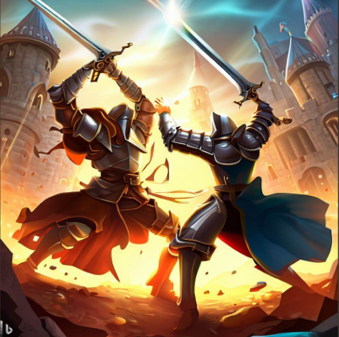

# Knight2D



# Table of content
1. [Introduction](#Introduction)
2. [Game](#Game)
3. [UML-diagram](#UML-diagram)
4. [Features](#Features)
5. [Challenges](#Challenges)
# 1.Introduction
<div style = "text-align: justify">
This is our game project for object-oriented programming at HCMIU in semester 2 (2022 - 2023). This is a classic game based on Platform game which is very popular among people all over the world. We have edited them in a classic style with the main character being a hero who is on the way to find and defeat the dark knight. On the way, the hero encountered many difficulties such as killing monsters and traps. We hope that you will enjoy our game project
</div>


## Team members and task allocation
| Number |   Name   | Student ID | Task | Contribute|
| :----: | :------: | :--------: |:----------------------------------------------:|:------------:|
|   1    |   Vo Hoai Bao   |   ITITIU21038   |Game Mechanic, GameLoop, Collision, Debugger, Git, Utilz   |      25      |
|   2    |   Thai Thanh Phat   |   ITITIU21274   |  GUI, Sound, UML, Maps, Utilz, GameStates     |      25      |
|   3    |   Nguyen Duc Duy    |   ITITIU21008   |Inputs, Entities, Utilz               |      25      |
|   4    |   Truong Dinh Toan   |   ITITIU21332   |        Objects, Levels, Utilz          |      25      |


## How to run project


1. **Step 1:** Clone the repository from GitHub.
```c
git clone https://github.com/ProjectGameOOPJava/Knight2D.git
```
2. **Step 2:** Open the game's source code folder in VS Code and check the file status.
```c
git status
```
3. **Step 3:** Run the game and chill.
   
# GAME
## About the game
- Language: [Java](https://www.java.com/en/)
- IDEs: [IntelliJ IDEA](https://www.jetbrains.com/idea/), [VSCode](https://code.visualstudio.com/)
- Library: [JavaSwing](https://docs.oracle.com/javase/tutorial/uiswing/)
- Game Engine: [Java2D](https://docs.oracle.com/javase/7/docs/api/java/awt/Graphics2D.html)
- Sound: [JavaSound](https://docs.oracle.com/javase/7/docs/api/javax/sound/sampled/Clip.html)
  
### Start game


